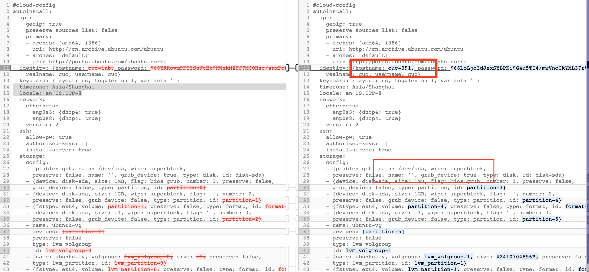

# 实验一 Linux基础

## 一、实验目的
- 配置无人值守安装iso并在Virtualbox中完成自动化安装。 
- Virtualbox安装Ubuntu后新添加的网卡实现系统开机自动启用和自动获取IP
- 使用sftp在虚拟机和宿主机之间传输文件

## 二、实验环境
- MacOS Catalina 10.15.7
- Virtualbox
- Ubuntu 20.04 Server 64bit

## 三、实验步骤
### 1⃣️配置无人值守安装iso并在Virtualbox中完成自动化安装
#### 1.  手动安装Ubuntu20.04

**用户名**：cuc

**NAT**：10.0.2.15

**Host-Only**：192.168.56.103

**确认宿主机可以ssh连接Linux**：
```shell
ssh cuc@192.168.56.103
```


#### 2. 配置SSH免密登录
1. ssh-keygen生成公钥-私钥对：
```shell
ssh-keygen
```


2. ssh-copy-id配置免密登录
```shell
ssh-copy-id -i ~/.ssh/id_rsa.pub cuc@192.168.56.103
```


---
#### 3. 定制无人值守安装镜像iso文件


1. ssh登录虚拟机创建一个工作目录用于克隆光盘内容
```shell
  mkdir clone

  cat << EOF > ~/clone/meta-data
  instance-id: 1
  local-hostname: cuc-091
  EOF
```


2. 在虚拟机中制作ISO镜像文件,镜像文件里的文件名必须是**user-data 和 meta-data** 


3. 获取手动安装Ubuntu后得到的初始「自动配置描述文件」，并将其从虚拟机中**利用sftp方式传输到宿主机中**
```shell
sudo scp cuc@192.168.56.103:/var/log/installer/autoinstaller-user-data ./
```


4. 利用在线文档对比工具Mergly对照老师提供的可用配置文件`user-data`对上述文件进行**酌情修改**



5. 将修改后的`autoinstall-user-data`文件**传回虚拟机中**，确认虚拟机已成功接受该文件，将其更名为`user-data`
-  宿主机中
```shell
scp ./autoinstall-user-data cuc@192.168.56.103:~/clone
```

- 虚拟机中
```shell
cd clone
mv autoinstall-user-data user-data
```


6. 利用**sftp传输方式**，宿主机得到包含`user-data`和`meta-data`的ISO镜像文件,假设命名为`091-init.iso`
```shell
sudo scp cuc@192.168.56.103:~/clone/091-init.iso ./
```


7. 新建一个名为`091-auto`的虚拟机，移除虚拟机「设置」-「存储」-「控制器：IDE」，并在「控制器：SATA」下新建2个虚拟光盘，**按顺序**先挂载「纯净版Ubuntu安装镜像文件」后挂载`091-init.iso`


---

#### 4. 激动人心的无人值守安装时刻
启动虚拟机，待命令行出现下述内容：
> Continue with autoinstall? (yes|no)

**手动输入yes**并单击回车后静候20分钟左右，程序便自动完成系统安装与重启进入系统的可用状态,完成✅
~~有亿点模糊~~


### 2⃣️Virtualbox安装Ubuntu后新添加的网卡实现系统开机自动启用和自动获取IP
#### 1. 为安装好的虚拟机手动添加一块新的网卡，并设置为`host-only`
#### 2. 开机并显示所有网络接口
```shell
ifconfig a
```
刚才添加的网卡已存在

#### 3. 查看当前系统的网络配置情况
```shell
ifconfig 
```
刚才添加的网卡并未分配ip地址

#### 4. 手动添加新网卡
```shell
sudo vim /etc/netplan/00-installer-config.yaml
```

#### 5. 应用修改后的网络配置
```shell
sudo netplan apply
```
#### 5. 查看网卡是否添加成功
```shell
ifconfig
```
确认新网卡已自动分配ip地址


### 3⃣️使用sftp在虚拟机和宿主机之间传输文件（一般方法）
- **简化版scp命令概要**
```shell
scp [OPTIONS] sourse target
```
- **把本地文件传输到远程主机**
```shell
scp 本地文件 [用户名@]远程主机IP地址:[目标文件路径]
```
- **把远程文件传输到本地主机**
```shell
scp [用户名@]远程主机IP地址:源文件 [本地路径]
```
具体应用已体现在上述实验过程中
## 四、实验过程中的问题与解决方案
- 使用scp在宿主机与虚拟机之间进行文件传输时报**Permission denied**，宿主机中需使用**sudo**启用管理员身份授予当前用户操作目录与文件的权限。 
- 在手动修改yaml文件并保存后应执行``netplan apply``命令应用修改,否则将看不到刚才的修改内容。

## 五、参考文献
- [ssh-keygen - Generate a New SSH Key](https://www.ssh.com/ssh/keygen/)
- [ssh-copy-id](https://www.ssh.com/ssh/copy-id)
- [ssh-keygen和ssh-copy-id实现免密登录远程主机](https://blog.csdn.net/feinifi/article/details/78213297)
- [sudo的介绍及基本用法](https://www.cnblogs.com/storyawine/p/13359393.html)
- [SFTP File Transfer Protocol - get SFTP client & server](https://www.ssh.com/ssh/sftp/)
- [Mac如何使用SSH远程连接linux及使用SFTP进行文件上传、下载](https://lmlxj.blog.csdn.net/article/details/80839322?utm_medium=distribute.pc_relevant.none-task-blog-BlogCommendFromMachineLearnPai2-1.control&dist_request_id=&depth_1-utm_source=distribute.pc_relevant.none-task-blog-BlogCommendFromMachineLearnPai2-1.control)
- [InstallCDCustomization](https://help.ubuntu.com/community/InstallCDCustomization)
- [老师提供的可用配置文件user-data](https://c4pr1c3.gitee.io/linuxsysadmin/exp/chap0x01/cd-rom/nocloud/user-data)
- [第八章番外：Cloud-Init](https://c4pr1c3.gitee.io/linuxsysadmin/cloud-init.md)
- [genisoimage and xorrisofs](https://wiki.debian.org/genisoimage)
