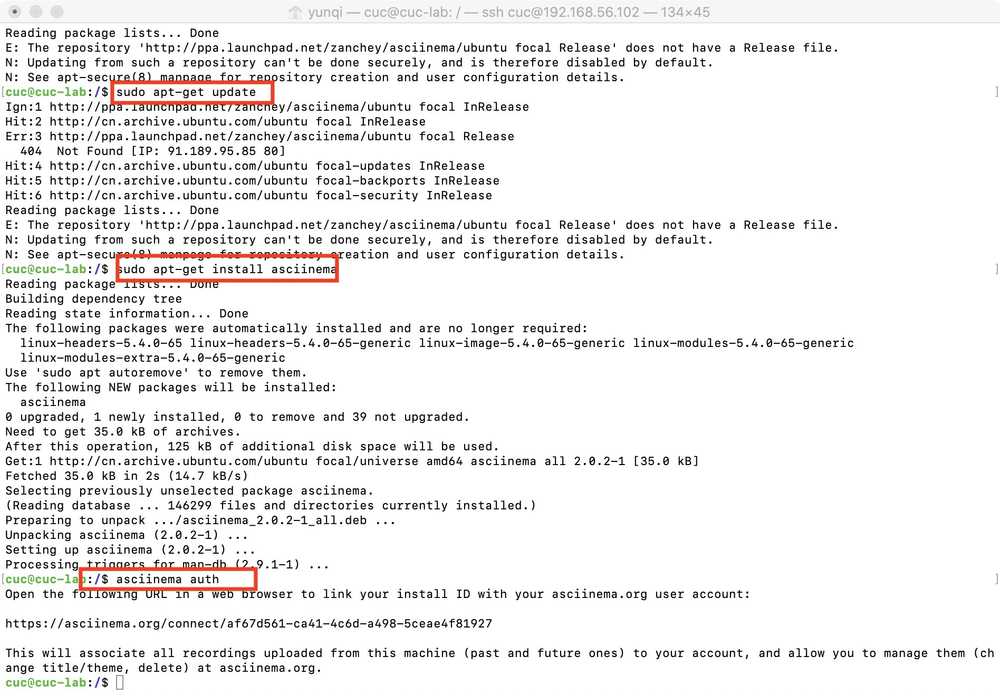

# 第二章实验
## 一、实验环境
- MacOS Catalina 10.15.7
- Virtualbox
- Ubuntu 20.04 Server 64bit

## 二、实验要求
- 确保本地已经完成asciinema auth，并在asciinema成功关联了本地账号和在线账号
- 上传本人亲自动手完成的vimtutor操作全程录像
- 在自己的github仓库上新建markdown格式纯文本文件附上asciinema的分享URL
- **提醒**避免在终端操作录像过程中暴漏密码、个人隐私等任何机密数据

## 三、实验步骤
### 1.注册asciinema并在本地配置

### 2.使用asciinema录制本人亲手完成的vimtutor操作全程
- lesson1

- lesson2

- lesson3

- lesson4

- lesson5

- lesson6

- lesson7

## 四、vimtutor完成后的自查清单
- **你了解vim有哪几种工作模式？**
    - 命令模式(command-mode)：操作文件
    - 插入模式(insert-mode)：在文本中插入内容
    - 可视模式(visual-mode)：通过``v``进入，可选区文本
    - 正常模式(normal-mode)：浏览、修改文本等
    - 选择模式(Select-mode)：在visual模式下``Ctrl+G``进入和退出模式，直接输入文字会进入inster模式并替换内容
    - EX模式(Ex-mode)：``ex``进入，``:vi``离开
    - 命令行模式(Command line mode)：``\``,``?``,``!``,``:``等
- **Normal模式下，从当前行开始，一次向下移动光标10行的操作方法？如何快速移动到文件开始行和结束行？如何快速跳转到文件中的第N行？**
    - 向下移动光标10行：``10j``
    - 移动到文件开始行：``gg``or``1G``
    - 移动到文件结束行：``G``
    - 跳转到文件第N行：``Ngg``or``NG``
- **Normal模式下，如何删除单个字符、单个单词、从当前光标位置一直删除到行尾、单行、当前行开始向下数N行？**
    - 删除单个字符：``x``or``dl``
    - 删除单个单词：
        - ``dw``：光标定位单词首字母，删除当前单词
        - ``de``：光标定位单词首字母及之前，删除后一个单词
        - ``daw``：光标定位单词最后一个字母及之前，删除当前单词或空格后的单词
        - ``db``：光标定位单词最后一个字母之后，删除该单词前一个单词
    - 从当前光标位置一直删除到行尾：``d$``or``D``
    - 删除单行：``dd``
    - 删除当前行开始向下数N行：``Ndd``
- **如何在vim中快速插入N个空行？如何在vim中快速输入80个-？**
    - 插入N个空行：
        - 向下插入：``No``
        - 向上插入：``NO`` ``ESC``
    - 输入80个-： ``80i/a-`` ``ESC``
- **如何撤销最近一次编辑操作？如何重做最近一次被撤销的操作？**
    - 撤销最近一次编辑操作：``u``
    - 重做最近一次被撤销的操作：``Ctrl+r``
- **vim中如何实现剪切粘贴单个字符？单个单词？单行？如何实现相似的复制粘贴操作呢？**
    - 剪切粘贴单个字符：
        ``x``
        ``p``
    - 剪切粘贴单个单词：
        ``dw``
        ``p``
    - 剪切粘贴单行：
        ``d$/D``
        ``p``
    - 实现相似的复制粘贴操作：
        ``v``进入可视模式,移动对文本进行选中;
        ``y``复制;
        ``p``粘贴.
    - 从vim向系统粘贴复制的内容： vim中``+y``，向其他应用程序中粘贴
- **为了编辑一段文本你能想到哪几种操作方式（按键序列）？**
    - ``a``在光标后插入内容，``A``在行尾插入内容；
    - ``ce``、``cw``、``c$``删除光标所在单词/行并更改内容；
    - ``dd``、``dw``、``d$``删除光标所在行/单词/光标到行末；
    - ``G``光标移动至文件尾，``gg``光标移动至文件首，``Ctrl+g``查看行号，``<行号>+shift+g``跳转至指定行号；
    - ``i``进入insert插入模式；
    - ``O``在光标定位行上方新建一行并进入插入模式，``o``键在光标下方新建一行并进入插入模式；
    - ``p``粘贴内容；
    - ``r``替换文字；
    - ``u``撤销当前操作，``U``复原某行至原始状态，``Ctrl+r``撤销撤销的操作；
    - ``v``进入可视模式，在此模式下移动光标可选中文本内容；
    - ``y``复制内容；
    - ``x``删除光标所选字符；
    - /<word> +``n``查找指定单词；

- **查看当前正在编辑的文件名的方法？查看当前光标所在行的行号的方法？**
``Ctrl+g``
- **在文件中进行关键词搜索你会哪些方法？如何设置忽略大小写的情况下进行匹配搜索？如何将匹配的搜索结果进行高亮显示？如何对匹配到的关键词进行批量替换？**
    - 关键词搜索：
        - \word ``n``向后搜索，``N``向前搜索;
        - ?word ``n``向前搜索，``N``向后搜索;
    - 设置忽略大小写的情况下进行匹配搜索：``:set ic``
    - 将匹配的搜索结果进行高亮显示：``:set hls``
    - 对匹配到的关键词进行批量替换：
        - ``:s/old/new``将该行头一个字符串old替换为字符串new；
        - ``:s/old/new/g``将该行所有的字符串old为字符串new；
        - ``:#,#s/old/new/g``将两行间字符串old替换为字符串new；
        - ``:%s/old/new/g``将文本中所有字符串old替换为字符串new；
        - ``:%s/old/new/gc``将文本中所有字符串old替换为字符串new，且向用户确认每个替换操作。
- **在文件中最近编辑过的位置来回快速跳转的方法？**
    - ``Ctrl+O``向前跳转；
    - ``Ctrl+I``向后跳转。
- **如何把光标定位到各种括号的匹配项？例如：找到(, [, or {对应匹配的),], or }**
将光标移至(,[,{，然后输入``%``
- **在不退出vim的情况下执行一个外部程序的方法？**``:!<command>``
- **如何使用vim的内置帮助系统来查询一个内置默认快捷键的使用方法？如何在两个不同的分屏窗口中移动光标？**
    - 查询一个内置默认快捷键的使用方法：
        - ``:help <shortcut>``查询normal模式下的快捷键；
        - ``:help i_<shortcut>``查询insert模式下的快捷键；
        - ``:help c_<shortcut>``查询command-line模式下的快捷键；
        - ``:help v_<shortcut>``查询visual模式下的快捷键；
    - 在两个不同的分屏窗口中移动光标：``(Ctrl+W)+W``

## 五、参考文献
- [vimtutor教程(双语版)](https://blog.csdn.net/zhaoyu106/article/details/72896216)

