# 实验5 Web 服务器的搭建
## 实验环境
- **虚拟机环境**
Ubuntu 20.04 Server

- **软件环境**
    - Nginx
    - VeryNginx
    - WordCompress 4.7


### 一、环境搭建

#### 更改主机hosts文件

```bash
# nginx
192.168.56.102 vn.sec.cuc.edu.cn
192.168.56.102 dvwa.sec.cuc.edu.cn
192.168.56.102 wp.sec.cuc.edu.cn
```

#### 安装配置Verynginx、Nginx、Wordpress、DVWA
**php及相关组件**

```bash
sudo apt install php-fpm php-mysql php-curl php-gd php-intl php-mbstring php-soap php-xml php-xmlrpc php-zip
```

**VeryNginx**
```bash
# 克隆VeryNginx仓库
git clone https://github.com/alexazhou/VeryNginx.git
cd VeryNginx
# python3
sudo python3 install.py install
```

- 安装python3前对缺失的库补充安装

```bash
# zlib
sudo apt-get install zlib1g-dev
# pcre
sudo apt-get update 
sudo apt-get install libpcre3 libpcre3-dev
# gcc 
sudo apt install gcc
# make
sudo apt install make
# penssl library
sudo apt install libssl-dev
```
- 配置
  
```bash
# 修改 `/opt/verynginx/openresty/nginx/conf/nginx.conf` 配置文件
sudo vim /opt/verynginx/openresty/nginx/conf/nginx.conf

#修改以下部分：

# 用户名
user  www-data;

# 监听端口
# 为了不和其他端口冲突，此处设置为8081
server {
        listen 192.168.56.102:8081;
        
        #this line shoud be include in every server block
        include /opt/verynginx/verynginx/nginx_conf/in_server_block.conf;

        location = / {
            root   html;
            index  index.html index.htm;
        }
    }
```


- 添加进程权限

```bash
chmod -R 777 /opt/verynginx/verynginx/configs
```

- 访问服务器的8081端口，安装成功
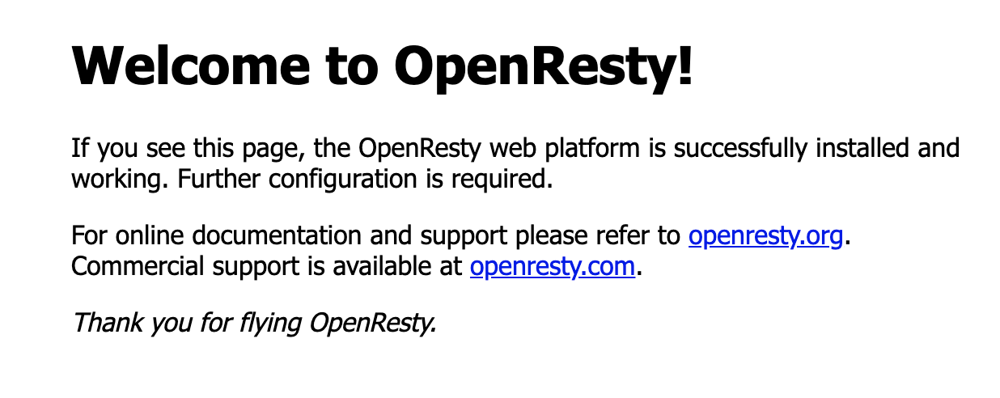

默认的用户名和密码```verynginx```/```verynginx``` 进入`verynginx/index.html` 

- 登陆成功
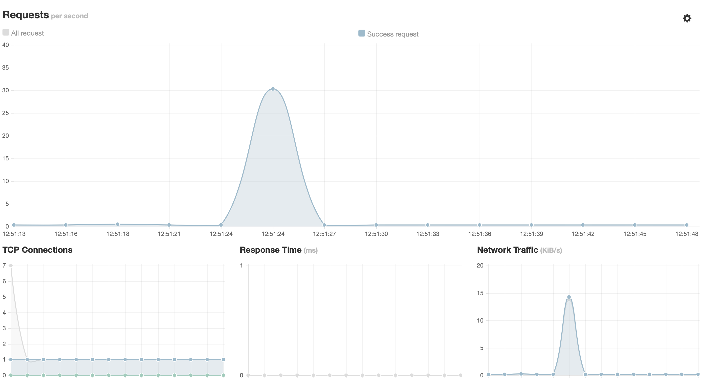

**Nginx**
- 安装
```bash
sudo apt install nginx
```
- 进入nginx目录

```bash
sudo vim /etc/nginx/sites-enabled/default
```

*部分配置文件*
```bash
root /var/www/html/wp.sec.cuc.edu.cn;

  # Add index.php to the list if you are using PHP
  index readme.html index.php;

location ~ \.php$ {
	#	include snippets/fastcgi-php.conf;
	#
	#	# With php-fpm (or other unix sockets):
		fastcgi_pass unix:/var/run/php/php7.4-fpm.sock;
		fastcgi_index index.php;
		fastcgi_param SCRIPT_FILENAME $document_root$fastcgi_script_name;
		include fastcgi_params;
	#	# With php-cgi (or other tcp sockets):
#		fastcgi_pass 127.0.0.1:9000;
	}
```

**WordPress**

- 安装与配置

```bash
# 下载安装包
sudo wget https://wordpress.org/wordpress-4.7.zip

# 解压
sudo apt install p7zip-full
7z x wordpress-4.7.zip

# 将解压后的wordpress移至指定路径
sudo mkdir /var/www/html/wp.sec.cuc.edu.cn
sudo cp wordpress /var/www/html/wp.sec.cuc.edu.cn

# 修改wp-config-sample中的内容，并更名为wp-config
sudo vim wp-config-sample
mv wp-config-sample wp-config
```
- 补充数据库信息

```bash
# 登录
sudo mysql
# 建库
CREATE DATABASE wordpress DEFAULT CHARACTER SET utf8 COLLATE utf8_unicode_ci;
# 新建用户
create user 'username'@'localhost' identified by 'password';
# 授权
grant all on wordpress.* to 'username'@'localhost';
```
- 修改配置文件
```php
// ** MySQL settings - You can get this info from your web host ** //
/** The name of the database for WordPress */
define('DB_NAME', 'wordpress');

/** MySQL database username */
define('DB_USER', 'username');

/** MySQL database password */
define('DB_PASSWORD', 'password');

/** MySQL hostname */
define('DB_HOST', 'localhost');

/** Database Charset to use in creating database tables. */
define('DB_CHARSET', 'utf8');

/** The Database Collate type. Don't change this if in doubt. */
define('DB_COLLATE', '');
```
- 进入wordpress


**DVWA**

- 安装
```bash
# 下载
git clone https://github.com/digininja/DVWA.git
# 建立目录
sudo mkdir /var/www/html/dvwa.sec.cuc.edu.cn
# 移动文件夹内容至该目录下
sudo mv DVWA/* /var/www/html/dvwa.sec.cuc.edu.cn
```
- 配置MySQL
```bash
sudo mysql
CREATE DATABASE dvwa DEFAULT CHARACTER SET utf8 COLLATE utf8_unicode_ci;
CREATE USER 'dvwa'@'localhost' IDENTIFIED BY 'p@ssw0rd';
GRANT ALL ON dvwa.* TO 'dvwa'@'localhost';
exit
```

- 配置PHP
```bash
sudo mv config.inc.php.dist config.inc.php

# 默认配置：
$_DVWA[ 'db_database' ] = 'dvwa';
$_DVWA[ 'db_user' ] = 'dvwa';
$_DVWA[ 'db_password' ] = 'p@ssw0rd';

# 修改php-fpm文件
sudo vim /etc/php/7.4/fpm/php.ini 

display_errors: Off
safe_mode: Off
allow_url_include: On
allow_url_fopen: On

#重启php
systemctl restart php7.4-fpm.service

#授权给www-data用户和组
sudo chown -R www-data.www-data /var/www/html/dvwa.sec.cuc.edu.cn
```

- 配置服务器块文件
```bash
sudo vim /etc/nginx/sites-available/dvwa.sec.cuc.edu.cn

# 写入配置文件
server {
    listen 8080 default_server;
    listen [::]:8080 default_server;

    root /var/www/html/dvwa.sec.cuc.edu.cn;
    index index.php index.html index.htm index.nginx-debian.html;
    server_name dvwa.sec.cuc.edu.cn;

    location / {
        #try_files $uri $uri/ =404;
        try_files $uri $uri/ /index.php$is_args$args;  
    }

    location ~ \.php$ {
        include snippets/fastcgi-php.conf;
        fastcgi_pass unix:/var/run/php/php7.4-fpm.sock;
    }

    location ~ /\.ht {
        deny all;
    }
}

# 创建软链接
sudo ln -s /etc/nginx/sites-available/dvwa.sec.cuc.edu.cn /etc/nginx/sites-enabled/

# 检查并重启服务
sudo nginx -t
systemctl restart nginx.service
```
- 成功访问dvwa

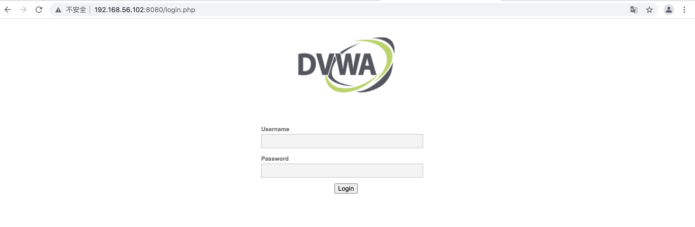
### 二、实验要求
#### 使用VeryNginx反向代理Wordpress,DVWA
- Matcher
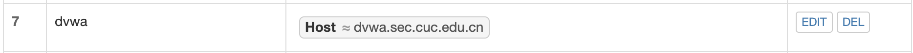
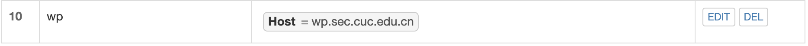
- Up Stream
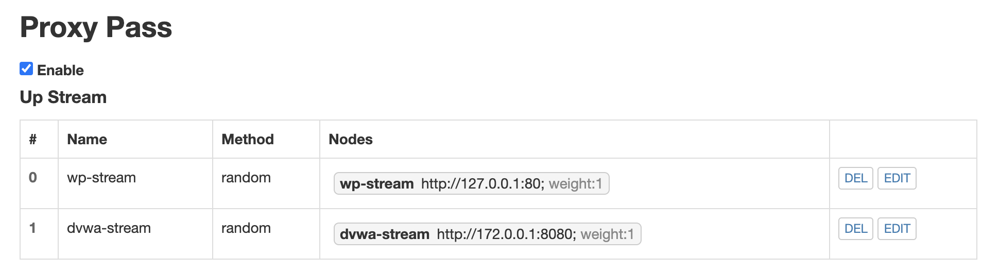
- Proxy Pass 
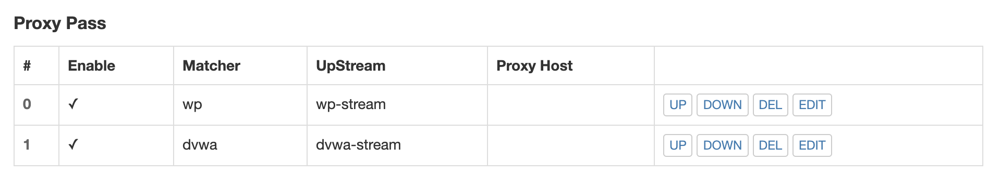
#### 安全加固要求
##### 使用IP地址方式均无法访问上述任意站点，并向访客展示自定义的友好错误提示信息页面-1
- Matcher
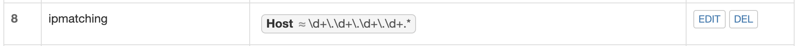
- Response
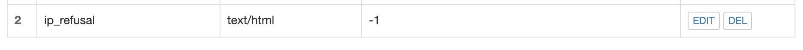
- Filter
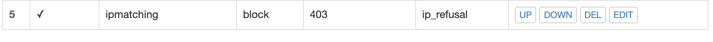
- 结果
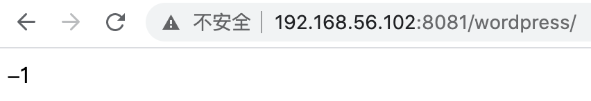

##### Damn Vulnerable Web Application (DVWA)只允许白名单上的访客来源IP，其他来源的IP访问均向访客展示自定义的友好错误提示信息页面-2
- Matcher
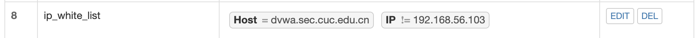
- Response
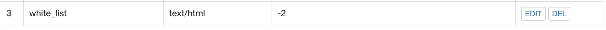
- Filter

- 结果
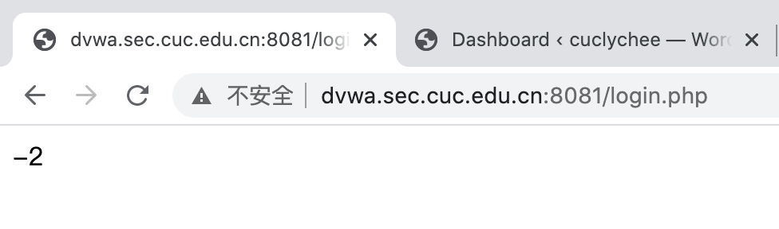


##### 通过配置VeryNginx的Filter规则实现对Damn Vulnerable Web Application (DVWA)的SQL注入实验在低安全等级条件下进行防护
- 将security level修改为low
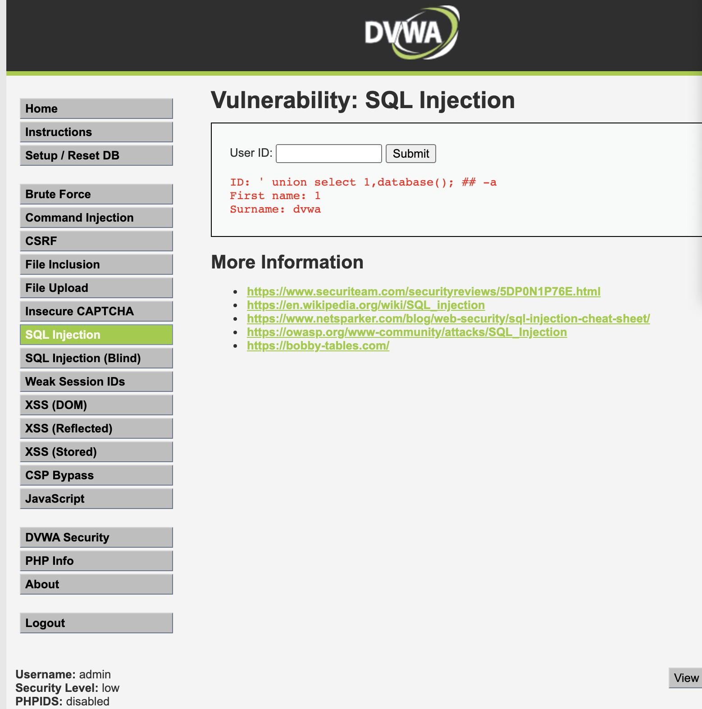
- Matcher
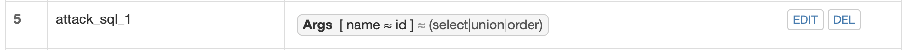
- Filter
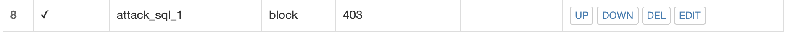
- 结果
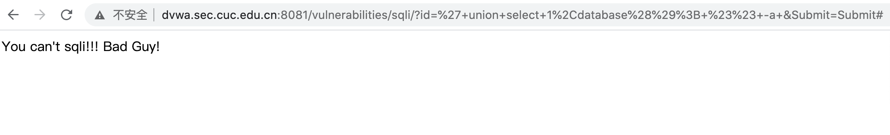

##### VeryNginx的Web管理页面仅允许白名单上的访客来源IP，其他来源的IP访问均向访客展示自定义的友好错误提示信息页面-3
- 添加Matcher
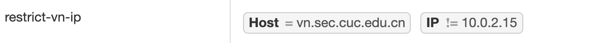
- 依次设置```Response``` ```Filter```
- 结果
    - 白名单ip访问
    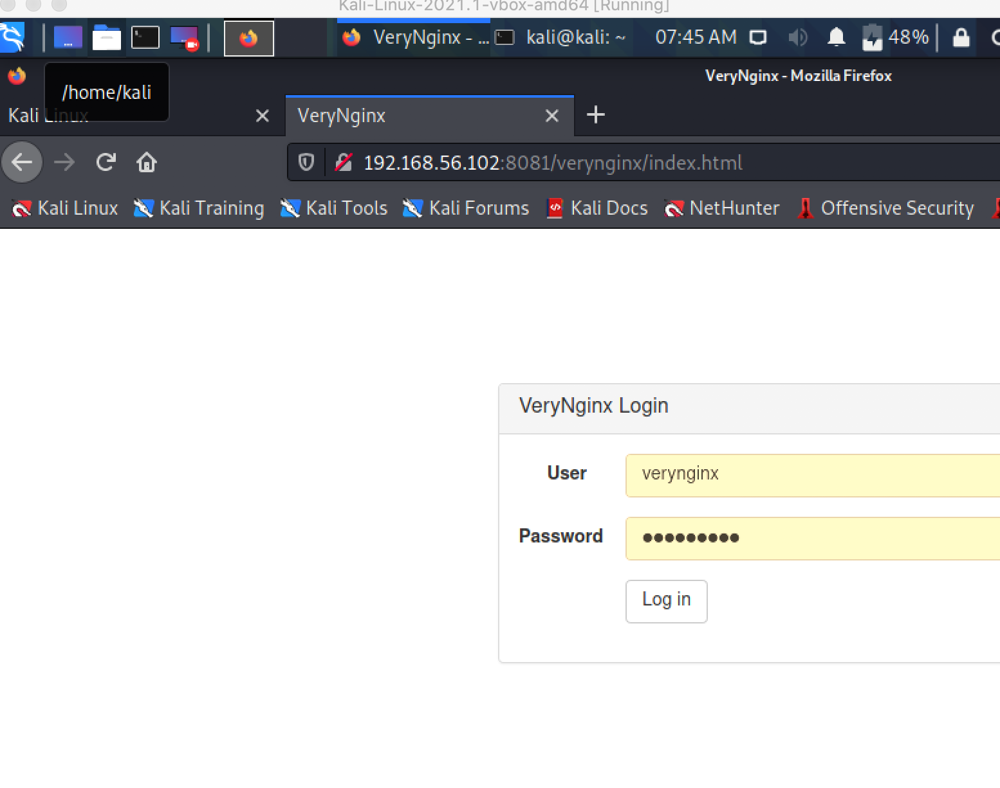
    - 其他来源ip访问
    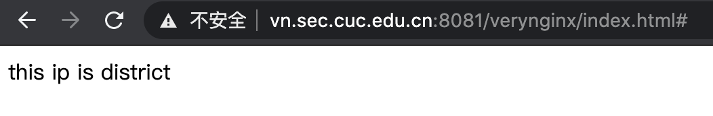
##### 通过定制VeryNginx的访问控制策略规则实现：
**限制DVWA站点的单IP访问速率为每秒请求数 < 50,限制Wordpress站点的单IP访问速率为每秒请求数 < 超过访问频率限制的请求直接返回自定义错误提示信息页面-4**
- Frequency Limit设置
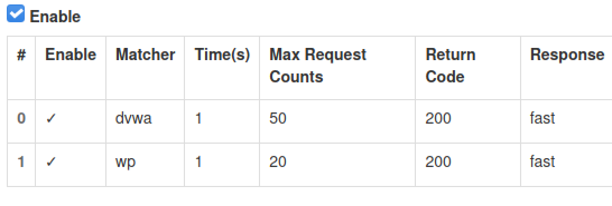
- 设置Response
- 使用ab压力测试工具
    - 访问wp.sec.cuc.edu.cn200次，180次失败了，拦截生效
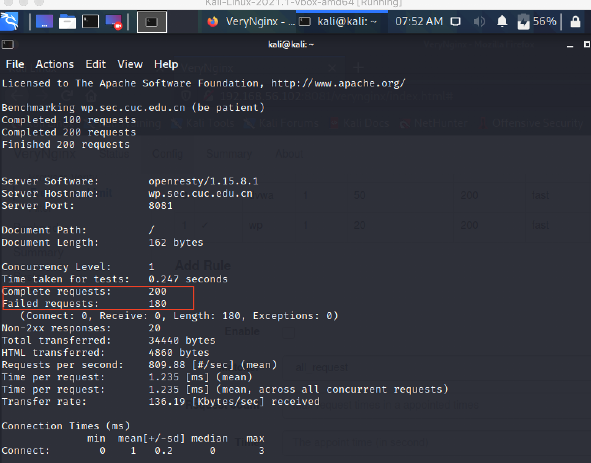

**禁止curl访问**
- Matcher
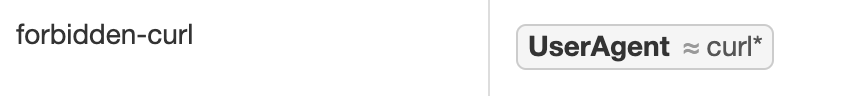
- Filter
- Response
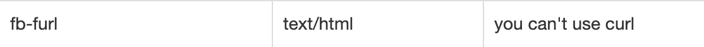
- 结果
    - 禁止前
    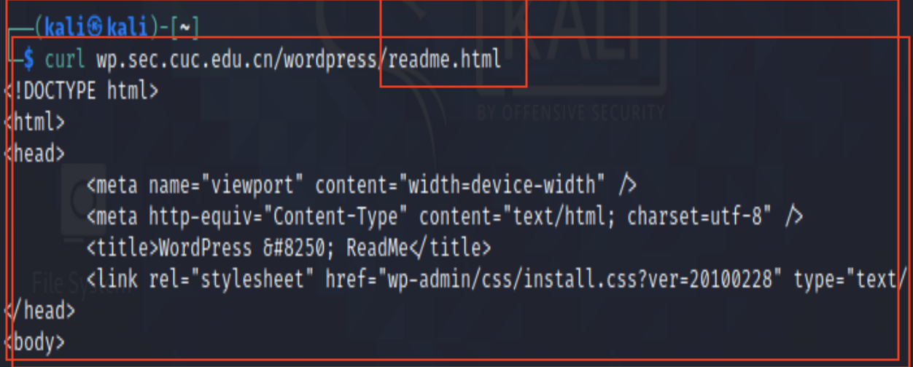
    - 禁止后
    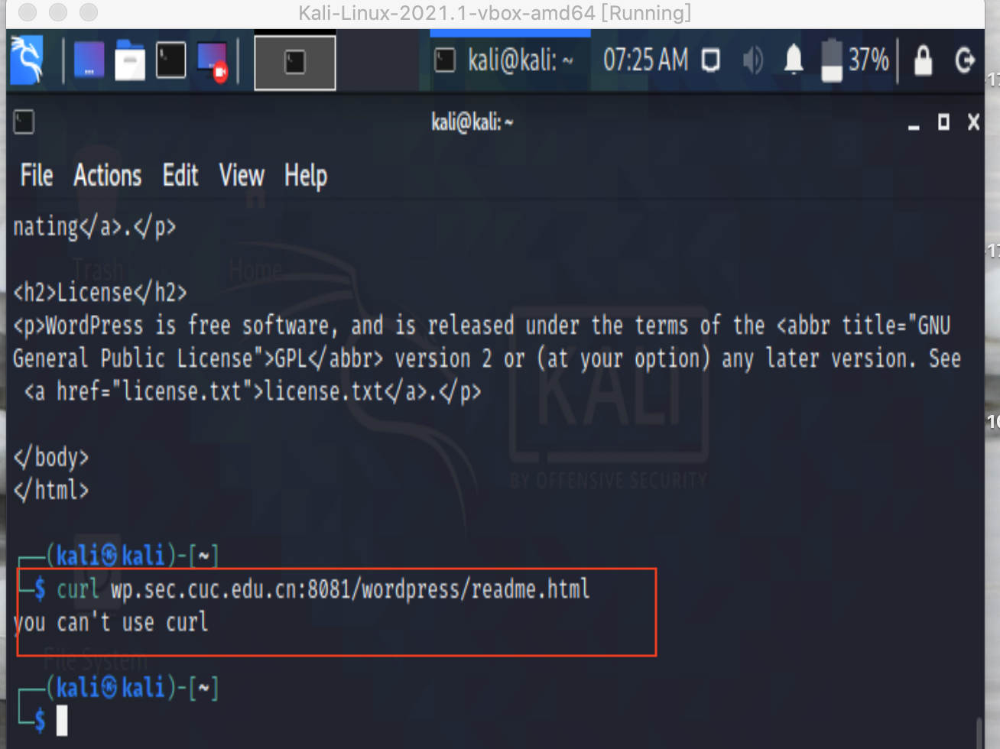
##### 在不升级Wordpress版本的情况下，通过定制VeryNginx的访问控制策略规则，热修复WordPress < 4.7.1 - Username Enumeration
- 过滤后
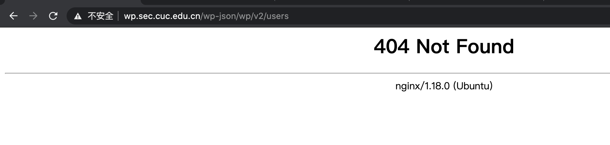

### 三、参考文档
- [How To Install Linux, Nginx, MySQL, PHP (LEMP stack) on Ubuntu 20.04](https://www.digitalocean.com/community/tutorials/how-to-install-linux-nginx-mysql-php-lemp-stack-on-ubuntu-20-04)
- [How To Install WordPress on Ubuntu 20.04 with a LAMP Stack](https://www.digitalocean.com/community/tutorials/how-to-install-wordpress-on-ubuntu-20-04-with-a-lamp-stack)
- [Nginx|WordPress](https://www.nginx.com/resources/wiki/start/topics/recipes/wordpress/)
- [WordPress Core < 4.7.1 - Username Enumeration](https://www.exploit-db.com/exploits/41497)
- [linux-2020-LyuLumos/ch0x05/](https://github.com/CUCCS/linux-2020-LyuLumos/blob/ch0x05/ch0x05/%E7%AC%AC%E4%BA%94%E6%AC%A1%E5%AE%9E%E9%AA%8C%E6%8A%A5%E5%91%8A.md)
- [2021-linux-public-EddieXu1125/chap0x05](https://github.com/CUCCS/2021-linux-public-EddieXu1125/tree/chap0x05)